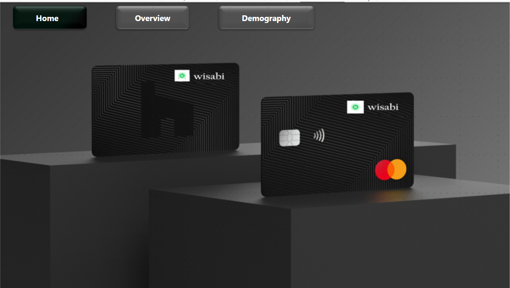
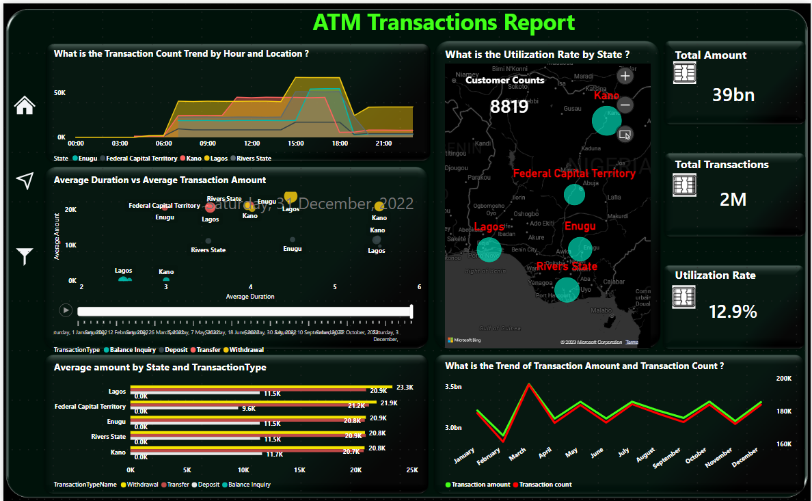
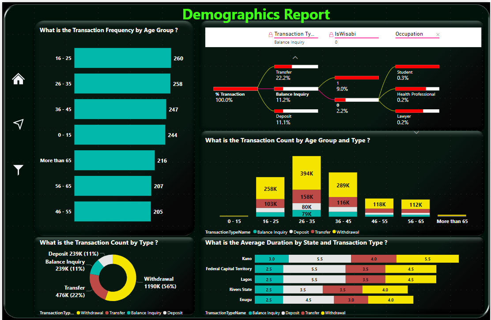

# ATM Transactions Analysis with Power BI

## Overview

The purpose of this project is to analyze the ATM transaction data for Wisabi Bank to gain insights on customer behavior, ATM usage, and identify opportunities to improve the bank's services. The data is sourced from the following files:

- `atm_location_lookup.csv`
- `calendar_lookup.csv`
- `customers_lookup.csv`
- `hour_lookup.csv`
- `transactions_type_lookup.csv`

The project is organized into three pages:

1. **Homepage:**
   - The homepage serves as the entry point to the project and provides an overview of the available analyses. No specific visualizations are present on this page.

   
   
3. **Overview Page:**
   - The overview page presents a comprehensive analysis of ATM transactions, including key metrics, trends, and patterns. Visualizations on this page offer a high-level summary of transaction data.

  
4. **Demographic Page:**
   - The demographic page dives deeper into customer demographics, providing insights into transaction behaviors based on customer characteristics. Visualizations include demographic-based analyses.

  
## Instructions

To explore the Power BI project, follow these steps:

1. **Download Power BI Desktop:**
   - If you don't have Power BI Desktop installed, download and install it from [Power BI Desktop](https://powerbi.microsoft.com/desktop/).

2. **Clone the Repository:**
   - Clone this GitHub repository to your local machine.

3. **Open the Power BI Project:**
   - Open the `ATM_Transactions.pbix` file using Power BI Desktop.

4. **Refresh Data (Optional):**
   - If needed, refresh the data connections in Power BI Desktop to load the latest data.

5. **Explore Pages:**
   - Navigate through the pages (Homepage, Overview, Demographic) to explore visualizations and insights.

6. **Interact with Visuals:**
   - Interact with the visuals to filter and explore the data dynamically.

## Data Sources

- `atm_location_lookup.csv`: Information about ATM locations.
- `calendar_lookup.csv`: Calendar-related data for transactions.
- `customers_lookup.csv`: Customer details.
- `hour_lookup.csv`: Data related to hours for transactions.
- `transactions_type_lookup.csv`: Lookup table for transaction types.

-  `enugu_transactions.csv`, `fct_transactions.csv`, `hour lookup.csv`, `kano_transactions.csv`, `lagos_transactions.csv`, `rivers_transactions.csv` :Merge this Six files into one , which are the Total transactions details from different states .
        

Feel free to contribute, report issues, or provide feedback!

## License

This project is licensed under the MIT License - see the [LICENSE](LICENSE) file for details.

